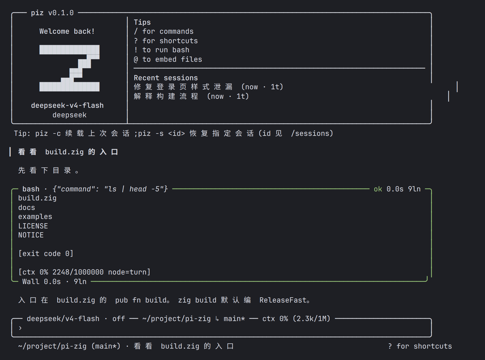
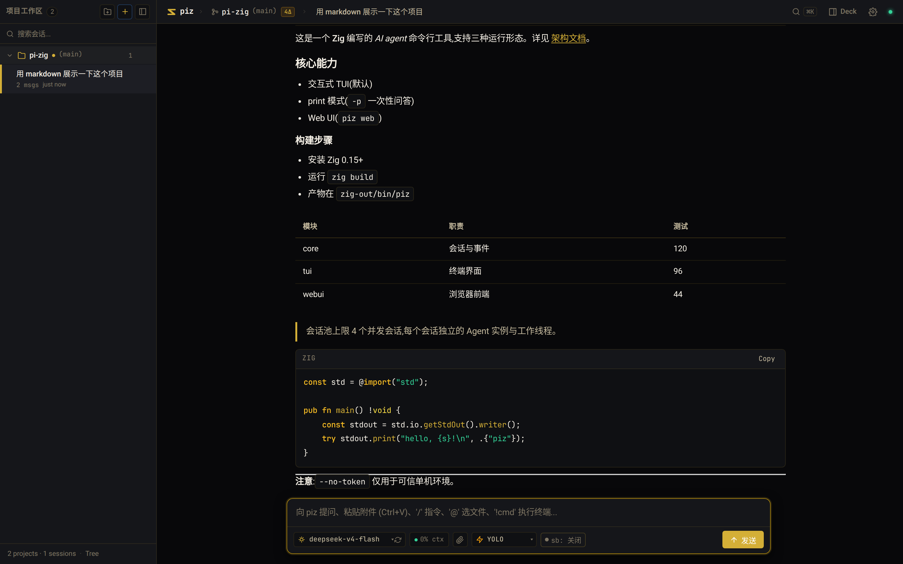

<p align="center">
  
</p>
<h1 align="center">piz</h1>
<p align="center">
  极简终端编码 agent。<a href="https://pi.dev">pi</a> 的 Zig 0.16 重写。<br>
  <sub>6.3 MB 单静态二进制 · 冷启 0.63 ms · Linux · Apache-2.0</sub>
</p>

<p align="center">
  
</p>
<p align="center"><sub>交互模式。开场是会话卡，对话用 <code>›</code> / <code>•</code>，输入在底栏框。空框按 <code>?</code> 看快捷键。</sub></p>

<p align="center">
  
</p>
<p align="center"><sub><code>piz web</code> 本地界面。侧栏按项目列会话，<code>/</code> 出命令；审批、缓存命中、上下文环在输入栏。</sub></p>

## 占用（同机实测，可复跑）

| | piz | pi(node 24) | 倍差 |
|---|---|---|---|
| 磁盘 | **6.3 MB** 单二进制 | ≈268 MB(运行时+包) | 42× |
| 冷启动 | **0.63 ms** | 471 ms | 746× |
| 峰值内存(`--version`) | **3.5 MB** | 154 MB | 44× |
| `piz web` 稳态 | **<9 MB**(200 并发后无泄漏) | — | |

Web 首屏 3 请求共 283 KB(gzip 65 KB),DOMContentLoaded 21 ms。全表与机况见 [benchmarks](docs/benchmarks.md),`./scripts/bench.sh` 一键复跑。

## 是什么

核心只做一条链路:组消息 → 调模型 → 跑工具 → 压缩。其余是编译期插件表,随二进制发布;不用的工具不进请求——少付 schema,也不打乱 prompt 前缀缓存。

| | |
|---|---|
| 工具 | 默认 8 个:`read` `write` `edit` `multi_edit` `grep` `find` `ls` `bash`。搜索认 `.gitignore`,`read` 带行号,写盘先 tmp 再 rename 且不得逃出工作区。其余 `--plugin` 才开 |
| 界面 | 终端 TUI + 本地 Web UI(`piz web`,内嵌页,手机竖屏适配)。皆可贴图,续会话从图回放 |
| 子 agent | 8 线程 worker 池,顶层排队 32、嵌套 4;孩子默认不带 `task`/`spawn_agent` |
| 依赖 | Zig 标准库 + vendored [stb](https://github.com/nothings/stb)。正则和 glob 是自己的,无 node_modules |

macOS 未验证。Windows 不做。

## 安装

需要 [Zig 0.16](https://ziglang.org/download/)。

```bash
git clone <repo> && cd pi-zig
zig build                 # 默认 ReleaseFast;调试传 -Doptimize=Debug
./zig-out/bin/piz --help
```

## 快速开始

密钥写 `~/.piz/auth.json`,或 `DEEPSEEK_API_KEY` / `ANTHROPIC_API_KEY` / `<PROVIDER>_API_KEY`:

```json
{ "deepseek": { "type": "api_key", "key": "sk-..." } }
```

```bash
cd ~/your-project
piz                       # 交互,默认新会话
piz -c                    # 续载该目录最近一次会话
piz -p "解释构建流程"     # 一次性问答
echo "总结这个文件" | piz -p
piz web                   # 本地 Web UI
piz doctor                # 体检:配置、沙箱、联网、git
```

权限三档:`-r` 只读(一个工具都不发)、默认逐项问、`-x` 全权。`--sandbox workspace` 把 bash 关进 bwrap。`--plugin lsp` 本次开启可选插件;持久写 `~/.piz/settings.json` 的 `plugins` 数组。

## 生态与扩展

三面机制,皆可免编译:

- **JS/TS 扩展**:内嵌 QuickJS-ng,`~/.piz/extensions/` 与项目 `.piz/extensions/` 启动即装,pi 式写法直跑(见下)。
- **资源包**:`piz pkg install <目录|git-url|name@marketplace>` 装 skills/prompts/AGENTS.md/前端插件,Git 仓库即 registry。
- **Web 前端插件**:SDK v1——slots、`renderTool`、storage、事件总线。

```ts
// ~/.piz/extensions/hello.js
export default function (pi: any) {
  pi.registerCommand("hello", { handler: (a: string) => "hi " + a });
  pi.registerTool({ name: "rand", description: "随机数", schema: {},
    execute: async () => String(Math.random()) });
  pi.on("agent_end", (e: any) => console.log?.(e.text));
}
```

ESM `import "./dep.mjs"`、TS 类型剥离、async handler、`pi.readFile/exec/fetch` 同步原语、TUI `/reload` 热重载。示例:[hello-tool.js](examples/extensions/)、[skill-pack](examples/skill-pack/)、[web-plugin](examples/web-plugin/)。全貌见 [生态](docs/ecosystem.md)。

## 文档

从 [docs/index.md](docs/index.md) 开始。

| | |
|---|---|
| [Usage](docs/usage.md) | 交互、斜杠命令、CLI、键位 |
| [Tools](docs/tools.md) | 核心工具与可选扩展 |
| [Configuration](docs/configuration.md) | 配置、provider、认证 |
| [Web UI](docs/web-ui.md) | `piz web`、鉴权、HTTP、前端架构 |
| [Plugins](docs/plugins.md) | 内置插件、钩子 |
| [Packages](docs/packages.md) / [生态](docs/ecosystem.md) | 资源包规约 / 装包、写包、分发 |
| [JS 扩展](docs/extensions-js.md) | QuickJS 窄桥:ESM/import/TS/async、fs/fetch、热重载 |
| [Benchmarks](docs/benchmarks.md) | 占用实测全表 |
| [Architecture](docs/architecture.md) | 模块、主链路、并发、Zig 0.16 |

## 与 pi 的关系

配置目录是 `~/.piz`,不与 pi 共用。`settings.json` / `auth.json` / `models.json` / `AGENTS.md` 格式兼容,可以从 `~/.pi/agent` 拷过来;会话文件格式不兼容(见 [Sessions](docs/sessions.md#会话格式与-pi-的差异))。

piz 做了 pi 明确不做的事:权限门、`/plan`、todo、任务委托、LSP、本地 Web UI。认 API key,也接 OpenRouter PKCE 与 Codex/xAI device-code;Claude Pro / ChatGPT Plus 订阅 OAuth 未接。

## 开发

```bash
zig build test            # 389 测试
zig fmt src build.zig
```

改并发或委派前读 [Architecture](docs/architecture.md) 的约束;各模块禁则见 [modules.md](docs/modules.md)。改前端只动 `src/webui/*.ts`,`zig build web` 重产 `webui.js` 后再全量构建(嵌件陷阱,详见 web-ui.md#前端架构)。

## 许可证

[Apache-2.0](LICENSE)。Copyright 2026 telagod。

重写自 [pi](https://github.com/earendil-works/pi)(MIT,Copyright (c) 2025 Mario Zechner)。上游声明在 [NOTICE](NOTICE)。独立实现,没有逐字拷贝的代码。
