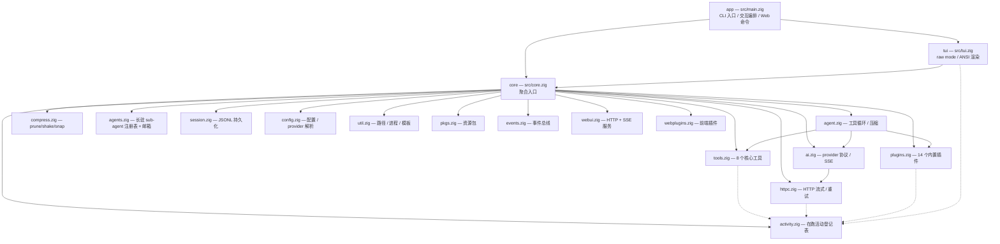
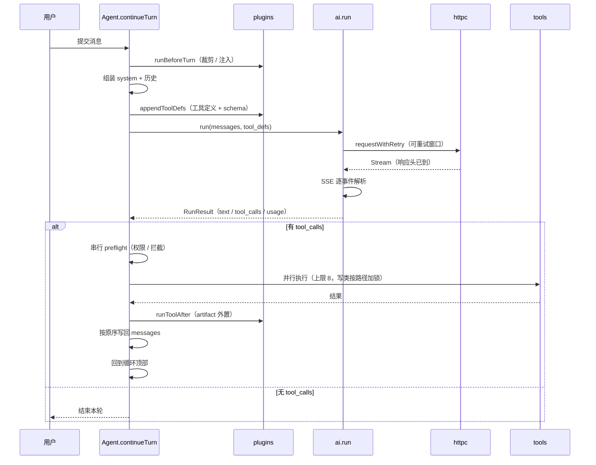

> 要改 piz 本身？让它先读这篇，再读你要动的那个模块。

# 架构

piz 是单个静态二进制，零第三方依赖，只用 Zig 标准库。约 1.9 万行 Zig。

## 目录

- [构建](#构建)
- [模块划分](#模块划分)
- [主链路](#主链路)
- [上下文管理](#上下文管理)
- [并发模型](#并发模型)
- [测试](#测试)
- [Zig 0.16 注意事项](#zig-016-注意事项)

## 构建

```bash
zig build              # 构建到 zig-out/
zig build run -- -p "hi"
zig build test         # 全量测试
zig fmt src build.zig  # 格式化
```

需要 Zig **0.16**。`zig build` 默认产出 `ReleaseFast`；调试需显式
`zig build -Doptimize=Debug`（测试目标固定 Debug）。

产物：

| 产物 | 内容 |
|------|------|
| `zig-out/bin/piz` | CLI 可执行文件 |
| `zig-out/lib/libpiz-core.a` | core 静态库 |
| `zig-out/lib/libpiz-tui.a` | tui 静态库 |

## 模块划分

三个构建模块，依赖单向：



实线是导入依赖，虚线指向 `activity.zig` —— 那是一张进程级单例表，谁在干活谁登记，
渲染端只读。它不构成分层依赖，是横切的。

各文件职责：

| 文件 | 职责 |
|------|------|
| `agent.zig` | 工具循环编排、消息组装、压缩、并行执行与写锁 |
| `compress.zig` | 快压三件套：prune / shake / snap，无 LLM |
| `ai.zig` | 两种 provider 协议的序列化与 SSE 流式解析 |
| `tools.zig` | 核心工具实现、glob 匹配、最小正则引擎、目录遍历 |
| `plugins.zig` | 内置插件表与钩子分发、插件工具 |
| `session.zig` | 会话文件读写、fork、截断、Web 会话管理 |
| `config.zig` | 配置文件加载、provider 合并、key 解析 |
| `httpc.zig` | `std.http.Client` 封装、SSE 解析、重试退避 |
| `util.zig` | 路径拼接、进程执行、模板渲染、配置目录、技能索引 |
| `activity.zig` | 在跑活动的无锁登记表：spinner／耗时／进度、取消世代、转后台 |
| `pkgs.zig` | 包安装/移除/枚举、marketplace 解析 |
| `events.zig` | 扫描包扩展声明、事件触发时 spawn 命令 |
| `webui.zig` | HTTP 服务、路由、SSE、鉴权 |
| `webplugins.zig` | 前端插件清单与资源服务 |
| `main.zig` | argv 解析、交互态编排、Web 会话池、print 模式 |
| `tui.zig` | raw mode、ANSI 渲染、输入解析、历史 |
| `e2e.zig` | 端到端测试（内嵌 mock provider，仅网络边界打桩） |

`webui.html` 是单页前端源码，通过 `@embedFile` 编译期嵌入二进制。

## 主链路

一轮对话的时序：



循环上限 `MAX_TOOL_ITER = 24`。

## 上下文管理

四层，从便宜到贵：

1. **快压**（`compress.zig`，`tool-output-pruner` 的 `before_turn`）— 无 LLM。
   - **prune**：同 path 再 read 立刻 supersede 旧结果；年龄裁优先动 cache 廉价尾（suffix ≤ 8K），不够才深裁。保护最近 16K，能省 ≥4K 才动手。skill 永不裁，最新一次 read 保留。
   - **shake**（用量 >70% 或 `/shake`）：撕掉旧 tool 结果与大 fence/XML。硬线前（>85%）再跑一次 protect=0 救援，避免单轮过大切不动。`/shake images` 只丢图。
   - **snap**（用量 >80% 或 `/snap`）：大段高 ASCII 打成多带密图并留 head/tail 摘。优先廉价尾（suffix ≤ 8K），无货才深打，少炸 prompt cache。无 vision / CJK / 图 token 不过关则跳过。tool 上的图在发请求时拆成 user 图块。`/fast-compress` 看用量与下一层。
2. **压缩**（`agent.zig` 的 `compact`）— 总 token 超窗口 85% 时触发，调模型生成摘要，保留最近 20% 窗口预算。切点只落在 `user`/`assistant`，绝不切断 tool 结果对。增量式：只总结上次边界之后的内容。
3. **跨会话记忆**（`cross-session-memory` 插件，`on_compact`）— 复用压缩摘要落盘，下次同目录启动注入。零额外调用。

压缩失败时 `compact-resilience` 换备用模型重试一次。

## 并发模型

| 场景 | 并发方式 |
|------|---------|
| 工具执行 | `std.Thread` + 信号量限流，同时在跑上限 8，流水线调度 |
| Web 会话 | 每会话独立 Agent + arena + worker 线程，池上限 4 |
| Web 连接 | 每连接一个 detach 线程，上限 64；无读超时（见 [Web UI](web-ui.md#资源上限)） |
| subagent 委派 | 每个一个 OS 线程 + 进程内独立 Agent，顶层并行 32、嵌套层 4（`PIZ_TASK_SPAWN=1` 回退到子进程）|
| 长驻 sub-agent | 每个一个 OS 线程 + 独立 Agent + 独立 arena，会话级上限 32 |
| 工具工作目录 | thread-local root，分发前由 `runToolSlot` 设为 `Agent.cwd` |
| 事件命令 | spawn 后 detach，不等待 |
| TUI 渲染 | 主线程轮询 stdin，worker 线程跑 agent |

**工具并行的三个约束**（改这块前必读）：

1. **结果顺序必须等于调用顺序。** 并行执行但按槽位下标写回。模型看到的顺序不稳定会让同一对话重放得到不同上下文。
2. **权限询问必须串行。** 在 preflight 阶段跑完所有询问，再并行执行获准的。并行弹多个提示是灾难。
3. **写类工具按路径互斥。** `write`/`edit`/`multi_edit` 对同一 `path` 加锁，否则两个工具各读旧内容、后写覆盖前写，丢掉一次修改。`multi_edit` 锁住 `files[]` 的每个路径（按字典序获取以避免死锁，重复路径先去重），只在超过 16 个文件时才退化为全局锁。
4. **消息列表跨线程读靠预分配契约。** `agent.messages` 预分配 8192 条容量（`MESSAGES_PRECAP`），append 永不触发 realloc；每条消息先写数据再 `len += 1`。HTTP 侧（/api/state、/api/sessions）与 CLI 状态栏因此可以无锁读 —— 最多看到「多一条刚写完的消息」，看不到半截数据。但 **HTTP 侧改 messages 的动作（undo/compact）必须过 `WebSession.turning` 门**：worker 在 send 期间 append、HTTP 在 shrink，两个线程同时改 len 是预分配解决不了的真竞态。

`before_turn` 钩子会改 `messages`，**不在并行区调用**。`on_tool_before` / `on_tool_result` 在串行阶段，可安全触碰共享状态。

**Web 会话销毁的顺序是硬约束**（`SessionPool.detachAndDestroy`）：

1. 持池锁 `swapRemove`，摘除后新请求再也拿不到这个会话
2. **锁外** 置 `stopping` + `aborted`，然后 `join` worker —— 进行中的一轮可能持续几十秒，持锁等它会把整个 web 服务卡住
3. 取出 arena 指针再 `deinit` —— `WebSession` 自己、`name`、`cwd`、`agent`、全部消息都在那个 arena 里，先 deinit 就是拿悬垂指针

`ChatQueue.dequeue` 必须同时看全局 shutdown 和 per-session 的 `stopping`。只看全局的话
worker 会在队列上 100ms 轮询到进程结束：实测 24 个会话建删留下 26 个空转线程、10MB
不回收的 arena。

插件若需跨调用状态，按 Agent 指针地址隔离并自己加锁（参考 `todo` 插件）。

**长驻 sub-agent 的四条约束**（改 `agents.zig` 前必读）：

1. **邮箱分两类读者。** `read_agent` 只给模型终态（`turn_done`/`failed`/`notice`），`progress` 被过滤 —— 逐条工具调用进上下文只是烧 token。进度走 `on_subagent` 回调给人看。`wait_agent` 同样只被终态唤醒，否则父 agent 会为「子 agent 在跑 bash」白烧一整轮。
2. **`waitMail` 必须在无人可产出时提前返回。** 全部 agent 都 `idle` 且没有排队输入 → 再等也不会有新结果，盲等满超时是纯浪费。
3. **邮箱有容量上限，满了丢最旧。** 一个话多的 agent 否则能吃光内存。丢头时 `read_cursor` 要跟着减，不然会把已读的又读一遍或越界。
4. **`close` 的 join 必须在锁外。** worker 可能正跑一轮（几十秒），持注册表锁等它会把所有 agent 操作冻住。

**进程内 subagent 的三条隔离要求**（改 `runTaskInProcess` 前必读）：

1. **每槽一个 arena。** `ArenaAllocator` 不是线程安全的，32 个槽共用一个会直接损坏它。槽 arena 从父 arena 借底层内存，读完结果统一释放。
2. **启用集与深度是 `Agent` 字段。** 插件启用状态从前是 `plugins.zig` 的进程级单例，一个 Agent 开了 skills 会让所有 Agent 都看到 skill 工具 —— 只读的调研子 agent 更不该因为兄弟 agent 的设置拿到写工具。深度同理：进程内没有新进程可继承 `PIZ_TASK_DEPTH`，环境变量只做进程基准。
3. **回调不能碰共享 arena，输出要整行写。** 32 路子 agent 并发调 `on_subagent`，用 `app.alloc`（arena）做 `allocPrint` 会竞争；多线程分段写 stderr 会切断多字节字符（实测出现过 UTF-8 解码失败）。改成栈缓冲 + `clampUtf8` + 一把锁整行写出。JSONL 路径尤其要锁：半行会让下游解析器直接失败。

### 活动登记表

`activity.zig` 是一张 16 槽的进程级单例表。工具/HTTP 请求/子 agent 开工时登记，
`tui.zig` 的主循环每 50ms 读一次渲染。它把五个原本各自为政的问题收成一个：

| 问题 | 修前 | 靠什么解决 |
|------|------|-----------|
| 长命令期间界面静止 | `dirty` 只在有新文本时置位，没人碰它 | 有活动就按 spinner 帧率重绘 |
| Ctrl+C 打不断工具 | `aborted` 只在迭代边界检查 | 取消世代，深层循环每 100ms 自查 |
| 并行工具分不清谁在跑 | 8 个同名 `read` 混在一起 | 每个活动一个槽位，带参数详情 |
| 重试期间静默 | 退避最长约 90 秒无任何反馈 | `attempt` + 倒计时写进详情 |
| 长命令只能等死 | 墙钟上限到点杀掉 | 转后台：去掉上限、不受取消影响 |

**为什么无锁。** 渲染在 UI 线程，登记在工具线程。渲染去拿锁就会被工具线程拖住 ——
那正是这个模块要消灭的病。槽位是固定数组，用 CAS 抢占；名称与详情写进定长 buffer。

**为什么两个标志。** `claimed` 在写内容**前**置位（防两个线程抢同一槽），
`active` 在写完**后**置位（渲染只看它）。合成一个的话渲染能读到 `start_ms` 还是 0 的槽位，
算出的耗时是整个系统启动时长 —— 屏幕上会显示一条刚起的命令已经跑了 `1m07s`。
这个 bug 真实发生过，`concurrent begin never publishes a half-written slot` 守着它。

**取消是世代而非布尔。** `cancelAll` 递增世代号，只有登记时世代匹配的活动才算被取消。
用布尔的话中断一次之后所有新活动都会立刻自杀，得重启进程。

槽位满了仍然登记，只是不显示。句柄自带 `gen` 与 `start_ms`，所以 `cancelled()` 和 `elapsedMs()` 照常工作 —— 早先这两个也跟着槽位失效，于是并发超过 `MAX_SLOTS` 时溢出的 subagent 既不响应 Ctrl+C（`pumpPipes` 靠 `cancelled()` 决定是否中止，永远拿到 `false`，只能跑满 10 分钟超时）也把耗时报成 0（模型据此以为任务瞬间完成）。少一行显示可以接受，丢掉取消能力不行。

### 自愈与止损

引擎替用户处理的四类异常，每一类都通过 `on_notice` 回调告知（TUI 里以 `·` 开头，
print 模式走 stderr，jsonl 是 `{"type":"notice"}`）。静默自愈和不自愈一样糟 ——
用户会把引擎的动作当成模型的胡言乱语。

| 情况 | 处理 | 上限 |
|------|------|------|
| 流读到一半断连（非用户中止） | 已收内容存进历史，追加「接着说，别重复」后续跑 | 2 次，之后交出不完整内容并说明 |
| HTTP 429/5xx/连接失败 | 指数退避重试，读 `Retry-After` | 3 次，封顶 30 秒 |
| 自动压缩失败 | 换备用模型重试一次，仍失败则明确告知「下一轮可能被拒」 | — |
| 模型空转（见下） | 先插一条「用已有结果作答」，再犯就停 | 两条判据各 2/3 次 |

断流那条的关键在**区分中止与断连**：用户 Ctrl+C 是意图，网络断开是故障。
前者保留 partial 后停下，后者保留 partial 后续跑。一个字都没收到才算真失败 ——
那时没有可保的东西，直接返回错误。

**空转防线有两条判据**，都是对着真实模型行为加的：

| 判据 | 抓什么 | 阈值 |
|------|--------|------|
| 调用完全相同 | 连续几轮发出同名同参的工具调用 | 连续 2 轮 |
| 成功输出完全相同 | 同一工具反复拿回同一份输出（工具名 + 内容的 hash） | 3 次 |

第二条是必需的，不是加固：实测模型会把 `./x.sh \| tail -1` 换成 `./x.sh 2>&1 \| tail -n 1`
再换成 `cd d && ./x.sh \| tail -1` —— 参数每次不同，参数级判据一次都不触发，
而 18 次调用里 5 次拿回的是同一份输出。加上输出判据后同一场景 6 次调用 31 秒收工（原先 18 次 100 秒）。

第一条针对更直接的情形：原样重发同一个调用，24 轮额度全烧光（54 秒），加防线后 6 轮 12 秒。
两种情况下请求体、`tool_call_id`、结果回传全部正确 —— 是模型侧行为，piz 只能止损。

合法用法不会撞上：逐个读文件输出各不相同，轮询等状态输出会变化。
两条判据各有一条测试守着，且互不兜底 —— 去掉任一实现，恰好对应那条测试失败。

### 切断时不让用户空手而归

三条止损路径（空转两条 + 迭代上限）都可能在模型**一个字正文都没产出**时返回。
抓原始 SSE 确认过：那种场景下 `delta.content` 全程只有 4 个 token，剩下 1107 次
全是推理增量。直接返回等于让 print 模式的 stdout 是零字节，`piz -p … | jq`
拿到空输入。

所以切断时把最后一份**成功**的工具输出交出去，并在前面标明它是原始输出而非模型的总结：

```
(模型未给出结论，以下是最后一次 bash 的原始输出)

done-42
```

三条边界：模型说过话就不覆盖；只取成功的输出（错误输出不许冒充答案）；
工具输出也为空时不编造内容。`salvageText` 一处实现，三条路径共用。

### 推理字段的两种叫法

`reasoning_content`（DeepSeek 系）与 `reasoning`（OpenRouter 等网关）都要认，
但**只能取其一** —— 实测某网关同时发两个且内容逐字节相同（1107 次全同），
两个都累加会让推理文本翻倍。优先前者，回退后者。

推理与正文严格分流：TUI 用 dim 斜体，print 模式走 stderr（stdout 留给管道下游），
jsonl 是独立的 `{"type":"reasoning"}` 事件。用 `2>&1` 观察会看到两者混在一起，
那是观察方式造成的，不是分流坏了。

## 数据安全

这几条都是「一次失败就永久丢东西」的地方，改动前先读清楚为什么这么写。

### 全量重写一律走原子替换

会话与配置文件都有「读出来、改几个字段、整体写回」的路径。直写目标路径的话，
写到一半失败（磁盘满、被 kill）会留下一个截断的文件 —— 原来的内容没了。
所以统一改成**写同目录临时文件再 rename**：要么看到旧文件，要么看到完整的新文件，
没有中间态。

| 路径 | 频率 | 为什么要原子 |
|------|------|-------------|
| `session.append` | 每条消息 | 纯追加，不需要 —— 最坏丢最后一条 |
| `session.truncate` / `setTitle` / `fork` | 低频 | 一次 `/undo` 就可能丢整份历史 |
| `saveWebTs` | **每轮 turn_end** | 频率高，崩溃窗口最大 |
| `writeJsonFile`（settings/models） | 改配置时 | `models.json` 里是全部 provider 的 apiKey |

权限统一 0600：会话是完整对话内容，`models.json` 是 API 凭证，都不该让同机
其他用户读到。

### 配置解析失败时拒绝写入

`saveSettings` / `saveModels` 的原意是「读现有内容，只改指定字段，保留未知字段」。
但解析失败时旧实现把 `root` 留成空对象继续写 —— 结果恰好相反：

```
改之前：212 字节（defaultProvider + plugins 列表 + 用户自定义字段，末尾一个语法错误）
改之后：28 字节（{"defaultModel":"newmodel"}）
```

实测确认过。`models.json` 上同样的操作会丢掉全部 apiKey。现在解析失败直接返回
`error.ConfigUnparseable` 并把原因告诉用户：语法错误用户自己能修，被覆盖就永远没了。

加载侧不同：那里**必须**容错（配置坏了也要能起来），所以降级为空配置，
但把坏掉的文件名记在 `Config.broken_files` 里、启动时点名。否则用户看到的是
「unknown provider」这类下游症状，猜不到是自己的 JSON 少了个逗号。

### 信号也要恢复终端

`restoreTerminal` 挂在 defer 上，而 defer 只在正常控制流跑。外部 `kill <pid>`、
关终端窗口（SIGHUP）、系统关机发来的信号走内核默认动作，进程直接死掉，
defer 一个都不执行 —— 终端被留在 raw mode，用户 shell 从此没有回显和行编辑，
只能 `reset`。实测确认可触发。

所以 `enterRaw` 成功后注册 SIGTERM/SIGHUP/SIGQUIT/SIGINT 处理器，用裸 syscall
复位 termios 并退出 alt screen。处理器里**只做这一件事** —— 终端是唯一
「不救就会伤到用户」的资源，刷会话、释放内存都不是 async-signal-safe，
放进来只会换一种死法。复位后恢复默认动作再重发信号，退出码保持 128+signo，
不把「被 SIGTERM 杀掉」伪装成正常退出。

### Web UI 的两道防线

绑定 127.0.0.1（`webui.zig` 硬编码）只挡远程，挡不住本机浏览器里的恶意页面 ——
它能向 localhost 发 POST 驱动 `bash`。所以：

1. **默认随机 token**（32 字符，经 URL fragment 交给前端存 sessionStorage）。
   生成失败时**拒绝启动**而非静默降级 —— 安全开关不许 fail-open。
2. **跨源写请求一律拒绝**：非 GET/HEAD 校验 `Origin`，只认本机主机名 + 本服务端口。
   无 Origin 头的放行（curl / 原生客户端）—— 浏览器的 fetch 与 form 提交都强制
   带 Origin，省不掉，所以这条豁免不会被网页利用。

第二道在 `--no-token` 模式下是唯一防线，也是 token 因 XSS 或误贴 URL 泄漏后的兜底。

## 性能与上下文预算

几个有实测依据的决策，改这些地方前先看数字。

### HTTP 连接复用

`httpc.zig` 用**进程级共享** `std.http.Client`，`keep_alive = true`。

从前每次请求新建一个 client，等于每轮都重做 TCP 握手 + TLS 握手。实测对 `api.deepseek.com` 约 220ms/次 —— 一轮对话最多 24 次工具迭代，光建连就能白扔 5 秒。复用后首次 182ms（含握手），稳态降到 70-90ms，每轮省约 100ms。

连接池**必须自己拥有 allocator**（用的是 `page_allocator`），不能借调用方的。池的寿命是进程级，而调用方的 allocator 可能是 arena 或会话级的 —— 借来的一旦释放，池里的连接就持有悬垂指针，下一次请求在 `Client.connectTcp` 里段错误。`FileLocks` 的注册表同理，它俩都踩过这个坑。

连接层出错时整池丢弃（`ClientPool.reset`），因为池里可能残留半死连接。

### token 估算

上下文预算走 `Agent.estTokens()`，按 UTF-8 序列长度分档计权：ASCII 4 字节/token，2 字节序列约 1.5 字符/token，3-4 字节（CJK、emoji）1 字符/token。

从前各处都写 `totalChars() / 4`，即「4 字节 = 1 token」。这对英文准，对中文严重低估：汉字占 3 字节而大致 1 字 1 token，估算只有真实值的约 0.77 倍。后果不是浪费窗口，是**请求失败** —— 128K 窗口下 `chars/4 > 85%` 换算到真实 token 已是窗口的 141%，provider 早就以超窗拒绝，compact 根本等不到触发。

实测：灌入纯中文直到触发压缩，新估算在真实 token 占窗口 83% 时触发（设计意图 85%，误差 2%）；旧估算要等到 110%。

`compact` 的保留预算与摘要请求的超窗兜底、`tool-output-pruner` 的保护窗口都走同一个估算函数 —— 这类换算散落各处就是 bug 的温床。

**估算范围 = 一次请求真正发出去的全部内容**：系统提示 + 全部消息 + 工具定义。工具定义曾被漏掉，那是恒定 **1065 token** 的低估（默认 9 个工具，开插件更多）—— 空会话实测 1122 token 里有 1065 是它。后果是压缩点从 85% 后移到 85.8%，以及 `get_context_remaining` 虚报同样多的余量。只读模式不发工具，所以不计入（实测空会话 87 token）。

工具定义的 token 由 `plugins.toolDefsTokens()` 算，和 `appendToolDefs` 同一套口径但**不分配** —— 预算估算在热路径上被反复调用，不该为了数几个字符去建一个 list。

### prompt caching

每轮工具迭代都要全量重发系统提示与工具定义。实测真实场景 **3217 token/轮**（系统提示 2153 + 工具定义 1064），8 轮迭代就是 25.7K token 重复发送。两种协议的应对方式完全不同：

**Anthropic —— 显式断点。** `system` 用数组形式并挂 `cache_control`：

```json
{"model":"...","max_tokens":8192,
 "tools":[...],
 "system":[{"type":"text","text":"...","cache_control":{"type":"ephemeral"}}],
 "stream":true,"messages":[...]}
```

断点只需一个，打在 `system` 末尾。Anthropic 按 `tools` → `system` → `messages` 的固定语义顺序拼接前缀，缓存的是「该块及其之前的全部内容」—— 所以 system 上的断点已经把 tools 一并纳入。反过来打在 tools 上会漏掉 system。

纯字符串形式的 `system` 挂不了断点，必须用数组。断点上限 4 个，超了报 400。`ttl` 省略等于 5 分钟，够 agent 的秒级迭代用；1h TTL 写入要 2 倍价，只有长时间等用户输入才值得。

最小可缓存长度按模型 512–4096 token，**低于阈值静默不缓存、不报错**——所以要靠响应里的 `cache_read_input_tokens` 判断是否真的生效，不能假定配了就有效。

**OpenAI / DeepSeek —— 全自动。** 不需要任何请求字段，服务端自动做前缀匹配（OpenAI 阈值 1024 token，DeepSeek 按 cache prefix unit 边界）。

> **JSON 顶层字段顺序不影响命中。** 服务端反序列化后按自己的模板重组 prompt，JSON object 本来就无序。piz 把 `tools` 写在 `messages` 之前只是让字面顺序反映语义顺序。真正影响命中率的是：tools 数组**内部**顺序每轮必须一致，messages 只在尾部追加、不在中间插改。

**响应字段路径三家都不同**，都要试：

| provider | 命中 | 写入 |
|---|---|---|
| Anthropic | `usage.cache_read_input_tokens` | `usage.cache_creation_input_tokens` |
| DeepSeek | `usage.prompt_cache_hit_tokens` | 不暴露 |
| OpenAI / GLM | `usage.prompt_tokens_details.cached_tokens` | 同级 `cache_write_tokens`（仅新模型） |

流式下 Anthropic 读 `message_start` 的 `message.usage`（`message_delta` 不保证带这两个字段）；OpenAI 兼容侧在最后一个 `choices` 为空的 chunk 里。

**`prompt_cache_key`（OpenAI 兼容侧）。** 服务端按 prompt 前缀的 hash 决定请求落到哪台机器；给一个稳定 key 能与前缀 hash 组合，让共享同一长前缀的请求路由到同一台，命中率更高。piz 用**工作目录**作 key —— 同目录的请求系统提示与工具集完全相同。官方文档写明它取代了 `user` 字段的缓存路由职责。

这个字段只写在 OpenAI 路径。Anthropic Messages API 没有它（靠显式 `cache_control` 断点），发过去是未知字段。DeepSeek 文档未列此字段，但实测 `HTTP 200` 静默忽略，所以对 OpenAI 兼容端点无条件发是安全的。

> 这个字段是读 codex 源码发现的：它用 `session_id` 作 key（`core/src/client.rs:484`），guardian 子会话则用 `guardian:{parent_thread_id}` 保持稳定。piz 选 cwd 而非会话 id —— 会话换了但系统提示与工具集没变，同目录的历史会话之间也该共享路由。

`Usage.cache_read` 与 `cache_write` 分开记：写入按 1.25 倍基础价、读取按 0.1 倍，混成一个数就看不出这轮是省了还是多花了。状态栏首次写入时显示 `cache warm` 而不是 `cache 0%` —— 否则看起来像没生效。

缓存统计**不参与压缩决策**。压缩是为了不超窗，超窗是硬失败，缓存只是省钱 —— 不能让省钱的考虑推翻防失败的机制。

压缩确实会作废 `messages` 段的缓存：`compact` 用 `clearRetainingCapacity` 后把摘要放在最前，历史被整段重写。codex 明令禁止这么做（AGENTS.md：*"No history rewrite — the context must be built up incrementally"*、*"Avoid frequent changes to context that cause cache misses"*），它的 `build_compacted_history_with_limit`（`core/src/compact.rs:629`）是把摘要 `push` 到历史**末尾**。

piz 保留「置前」，理由是两者的压缩语义不同：codex 保留 user 消息 tail 再追加摘要，历史只增不减；piz 用摘要**替换**被压缩的区段，这正是它能把 125K token 压回预算的机制。改成追加就等于不压缩了。

代价有测试钉住数字（`ai.zig` 的 `compaction placement determines how much request prefix survives`）：追加保住的共同前缀严格多于置前，但**置前仍然保住 tools + system**——因为它们在请求里排在 `messages` 之前。作废的只有对话消息那段，而它本来每轮都在变。每轮固定的 3217 token 照旧命中。

## 测试

```bash
zig build test          # 177 个测试
```

两个测试目标：`core.zig` 为根（收集全部 core 模块的 test 块）、`main.zig` 为根（含 `e2e.zig`）。Zig 的 `zig test` 只收集根模块的测试，所以要分两个目标。

### 约定

- 用 `std.testing.tmpDir` 造真实文件树，`std.Io.Threaded.chdir` 进临时目录（记得 `defer` 切回）
- 每个测试开头 `try util.testInit()` 初始化 `util.io` 与 `util.environ_map`
- 用 `util.Arena` 管理测试期分配
- 隔离配置目录：往 `util.environ_map` 写 `PIZ_DIR`
- **不要往 stdout 打调试日志** —— 会破坏 `zig build test` 的 `--listen=-` IPC 协议，导致打印 `failed command` 但退出码 0 的假失败
- **新模块必须显式加进 test 块才会被收集。** Zig 只跑 `_ = @import(…)` 列出的测试；
  引用一个模块（`const m = @import("x.zig")`）不会自动收集它的测试。`webui.zig` 的
  `parseChatText` 测试因此从写下起就没跑过。core 里的模块加到 `core.zig` 的 test 块，
  只被 main 引用的（`webui.zig`）在 `main.zig` 的 test 块里 `_ = webui_mod;` ——
  不能再 `@import` 一次，同一文件同时属于 root 与 core 两个模块会编译失败。

### e2e 测试

`e2e.zig` 内嵌一个 mock HTTP server 顶替 provider，走真实的 `Agent.send` / 工具执行 / SSE 解析 / 权限回调 / 自动压缩 / 记忆注入路径。只有网络边界是打桩的。

### 契约测试

有几个测试守着容易写坏的契约：

| 测试位置 | 守什么 |
|---------|--------|
| `ai.zig` | 所有工具 schema 是合法 JSON object 且 `type == "object"` |
| `ai.zig` | schema 真的进了请求体（`parameters` / `input_schema`） |
| `plugins.zig` | 插件工具不允许留空 schema |
| `agent.zig` | 并行执行的结果顺序等于调用顺序 |
| `agent.zig` | per-file 锁下同文件双写不丢 |
| `tools.zig` | `multi_edit` 失败时磁盘未被修改 |
| `plugins.zig` | LSP 帧解码容忍不完整/堆叠/LF-only 数据 |
| `plugins.zig` | 语言服务器缺失时优雅报错而非崩溃 |
| `ai.zig` | 系统提示确实送达两种协议（Anthropic 走顶层 `system`） |
| `agent.zig` | token 估算不低估 CJK 文本 |
| `agent.zig` | 不同文件的并发写真并行且内容不丢 |
| `agent.zig` | `multi_edit` 重复路径去重后再加锁（否则自锁死） |
| `ai.zig` | Anthropic 请求带 `cache_control` 断点且落在 system 上 |
| `ai.zig` | 可缓存前缀超过最小阈值且含 tools + system |
| `ai.zig` | 三家 provider 的缓存字段路径都能解析 |
| `e2e.zig` | 真实请求里 tools 排在 messages 之前 |
| `plugins.zig` | 子 agent 继承 cwd / model / 只读模式 |
| `plugins.zig` | 委托并行跑且失败按任务归因（含 stderr 诊断） |
| `main.zig` | 委托端到端：真实 piz 子进程的答复从 stdout 回传 |
| `plugins.zig` | 委托深度上限拦住递归 spawn（跨进程传递） |
| `ai.zig` | 压缩置前仍保住 tools + system 的缓存前缀 |
| `ai.zig` | `prompt_cache_key` 在稳定区且不出现在 Anthropic 请求 |
| `agent.zig` | token 估算含每轮重发的工具定义（只读模式除外） |
| `plugins.zig` | 预算报告区分固定工具开销与压缩线余量 |
| `activity.zig` | 并发登记不会发布写了一半的槽位（否则耗时显示成系统启动时长） |
| `activity.zig` | 取消世代只影响当时在跑的活动，之后新起的不受影响 |
| `e2e.zig` | 流中途断连保住已收文本并自动续跑 |
| `e2e.zig` | 连续相同的工具调用远早于迭代上限被切断 |
| `e2e.zig` | 参数不同但输出相同的重复调用同样被切断 |
| `e2e.zig` | 切断时模型无正文则交出最后一份工具输出 |
| `e2e.zig` | 填补永不覆盖模型自己产出的正文 |
| `ai.zig` | 推理认两种字段名且同时出现时不翻倍 |
| `plugins.zig` | 委派结果保持多行可读、失败任务保留 partial 输出 |
| `plugins.zig` | 子 agent 只读模式只能收紧不能放宽 |
| `plugins.zig` | HTML 抽正文丢掉 script/style 内容、`<p>` 不误伤 `<pre>` |
| `session.zig` | 全文重写换掉 inode（证明走了 rename 而非原地截断） |
| `session.zig` | web 会话重写原子、权限 0600、坏行不致整体失败 |
| `config.zig` | 语法坏掉的配置永不被覆盖，修好后未知字段仍保留 |
| `config.zig` | 加载点名解析失败的文件，但仍能降级启动 |
| `webui.zig` | 跨源写请求被拒（含 `null` Origin 与错端口） |
| `webui.zig` | 查询参数按 `&` 切分，`?notws=` 不会顶替 `?ws=` |
| `webui.zig` | 未注册的 `?ws=` 被拒，hook 未接线时 fail-closed |
| `webui.zig` | `okJson` 对超过任何定长缓冲的值仍产出完整 JSON |
| `util.zig` | `clampUtf8` 永不切在码点中间（中文、emoji 全长度扫一遍） |
| `session.zig` | 落盘标题裁到 256 字节且是合法 UTF-8 |
| `webui.zig` | SSE 槽位满员时拒绝、正常注销复用同号、僵死槽位被回收 |
| `webui.zig` | `dequeue` 认 per-session stop，不只认全局 shutdown（否则 worker 永不退出） |
| `webui.zig` | **HTTP 层**：SSE 满员回 503 且响应里不含 200（拒绝发生在写头之前） |
| `webui.zig` | **HTTP 层**：600 字符标题仍拿到完整可解析 JSON，标题裁到 256 字节 |
| `webui.zig` | **HTTP 层**：恶意 Origin 403、本服务自身 Origin 放行 |
| `webui.zig` | **HTTP 层**：未注册 `?ws=` 403、已注册放行、空 ws 放行 |
| `e2e.zig` | provider 请求真并发（并发峰值 >1）且响应互不串扰 |
| `tools.zig` | 工具相对路径相对 Agent.cwd 解析，root 是 thread-local |
| `tools.zig` | bash 在 Agent.cwd 里跑（相对路径与写文件都落在那儿）|
| `activity.zig` | 槽位满员时 `cancelled()`/`elapsedMs()` 仍有效（否则溢出的 subagent 无法 Ctrl+C）|
| `tools.zig` | `appendCapped` 保尾且缓冲永不超过 2× 窗口（管道内存有界的全部依据）|
| `tools.zig` | 截断提示里的 total 是真实流量，不是被裁后的缓冲长度 |
| `plugins.zig` | 嵌套层并行上限远小于顶层，最坏进程数有可算上界 |
| `plugins.zig` | 插件启用集 per-Agent，两个集合互不影响（从前是进程级单例）|
| `plugins.zig` | 深度闸门看 `Agent.depth`，环境变量只做进程基准 |
| `e2e.zig` | 进程内 subagent 实时转发工具事件，每路有独立序号 |
| `e2e.zig` | 嵌套委派被深度闸门拦住（不递增就是无限递归）|
| `agents.zig` | 邮箱账本：注册、投递、drain 推进游标、interrupt 插队首 |
| `agents.zig` | 邮箱满了丢最旧，游标保持合法 |
| `agents.zig` | `wait` 被结果唤醒而非 progress；无人可产出时立刻返回 |

## Zig 0.16 注意事项

0.16 的 std 与旧版差异大，改代码时注意：

| 场景 | 0.16 写法 |
|------|----------|
| 动态数组 | `std.array_list.Managed(T).init(alloc)` |
| 写入器 | `std.Io.Writer.Allocating.init(alloc)`；`.written()` 借用，`.toOwnedSlice()` 转移所有权 |
| 文件读 | `std.Io.Dir.cwd().readFileAlloc(util.io, path, alloc, .limited(N))` |
| 文件写 | `std.Io.Dir.cwd().writeFile(util.io, .{ .sub_path = p, .data = d })` |
| 目录遍历 | `openDir(util.io, path, .{ .iterate = true })` 然后 `d.iterate()` + `it.next(util.io)` |
| stat | `statFile(util.io, path, .{})` |
| 子进程 | `std.process.spawn(util.io, .{ .argv = &.{...}, .stdout = .pipe })` |
| 环境变量 | `util.environ_map`（`std.posix.getenv` 已移除） |
| 互斥锁 | `std.Io.Mutex`，`lock(io)` 可取消 / `lockUncancelable(io)` 不可取消 |
| 随机数 | `util.io.random(&buf)`（`std.crypto.random` 已移除） |
| 睡眠 | `std.Io.sleep(util.io, .{ .nanoseconds = N }, .awake)` |
| 时钟 | `std.Io.Clock.now(.real, util.io).nanoseconds` |
| 格式化补零 | **没有** `{d:0>2}` 之类的填充语法，手工拼（`if (n < 10) "0" else ""`） |
| 裸 fd 读写 | `std.posix.read`/`write`/`close` 已移除，用 `std.os.linux.*`（返回 `usize`，负值是 `-errno`） |
| 进程组 | `spawn` 的 `.pgid = 0` 让子进程当组长，之后 `std.posix.kill(-pid, SIG)` 收整棵树 |
| 信号处理器签名 | 参数是 `std.posix.SIG` 枚举而非 `i32`；数组元素类型写 `@TypeOf(std.posix.SIG.TERM)` 让编译器推 |
| socket 超时 | **做不到。** `Stream` 没有超时 API（`receiveTimeout` 只在 `Socket` 上，是 UDP 用的）；`setsockopt(SO_RCVTIMEO)` 会让 `recv` 返回 `EAGAIN`，而 `Io.Threaded` 假定 fd 全是阻塞的、把 `EAGAIN` 当 programmer bug（Debug 直接 panic）。要超时只能靠看门狗线程 `shutdown(fd, SHUT_RD)` 制造干净的 EOF |
| `recv` | `std.posix.recv` 已移除，裸调 `std.os.linux.recvfrom(fd, buf, len, flags, null, null)`（返回 `usize`，负值是 `-errno`） |
| `statFile` | 三个参数：`statFile(io, path, .{})`，少了第三个会报 "expected 3 argument(s)" |

**`toOwnedSlice()` 转移所有权后 `defer deinit()` 无内容可释放。** 如果接收方只是拷贝（比如 `tui.appendLine`），那块内存就永久泄漏了 —— 这种情况用 `.written()` 借用。

**HTTP 响应体不要进定长栈缓冲。** `try std.fmt.bufPrint(&buf, …)` 装不下时返回
`error.NoSpaceLeft`，错误从 handler 冒出去，**响应头都还没写**，客户端只看到连接
断开。写操作往往已经生效，读路径又走同一段代码 —— 于是这个端点在进程余生里每次
都断连。`webui.zig` 的 `okJson` 用 `Writer.Allocating` 兜住这一类；只有输出是固定
字面量时（`/api/mode` 的布尔）才不需要分配。

`httpc.zig` 里有几处对 `std.http.Client` 内部指针语义的手工修补（`Request.client`、`Response.request`、连接池里的 `conn.client` 都要在结构体从栈拷到堆后重新指向）。这是对 std 私有实现细节的依赖，升级 Zig 时优先检查这里。

`util.io` 与 `util.environ_map` 是全局单例，在 `main` 里从 `std.process.Init` 赋值，测试里由 `util.testInit()` 初始化。
